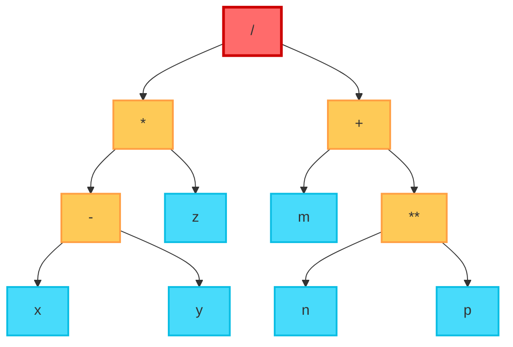
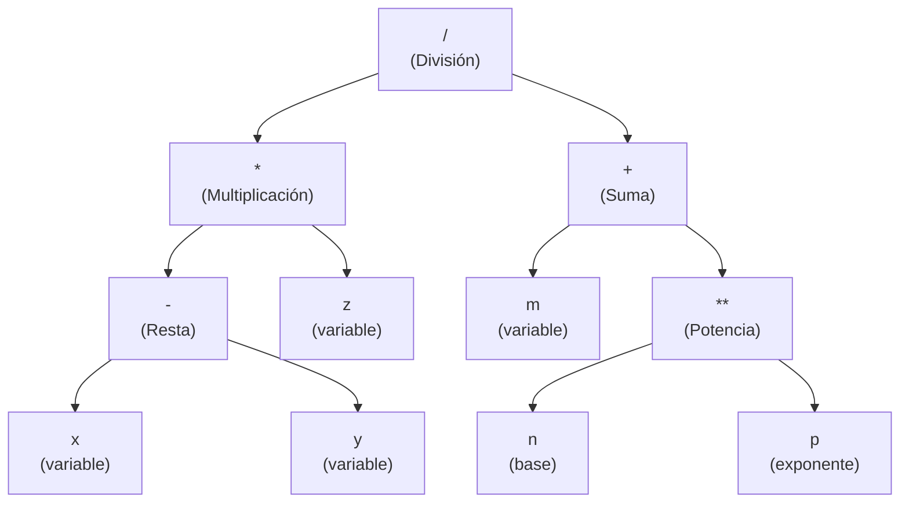

# Árbol de Expresión: [ ( x - y ) * z ] / ( m + n ** p)

## 📝 Representaciones de la expresión

| Notación | Expresión |
|----------|-----------|
| **Infija** | `((x - y) * z) / (m + (n ** p))` |
| **Prefija** | `/ * - x y z + m ** n p` |
| **Postfija** | `x y - z * m n p ** + /` |

## 🌳 Árbol de Expresión


## 📊 Propiedades del Árbol

| Característica | Valor |
|----------------|-------|
| **Raíz** | `/` (división) |
| **Altura** | 3 |
| **Total de nodos** | 11 |
| **Nodos hoja** | 6 (x, y, z, m, n, p) |
| **Nodos internos** | 5 (/, *, -, +, **) |

## 🔍 Recorridos del Árbol

| Recorrido | Secuencia |
|-----------|-----------|
| **Preorden** | `/ * - x y z + m ** n p` |
| **Inorden** | `x - y * z / m + n ** p` |
| **Postorden** | `x y - z * m n p ** + /` |

## 📝 Evaluación (ejemplo con valores)

Si: `x=10, y=3, z=2, m=5, n=2, p=3`
```
1. x - y = 10 - 3 = 7
2. (x - y) * z = 7 * 2 = 14
3. n ** p = 2 ** 3 = 8
4. m + (n ** p) = 5 + 8 = 13
5. [(x - y) * z] / [m + (n ** p)] = 14 / 13 ≈ 1.077
```

## 🎨 Versión con etiquetas descriptivas

