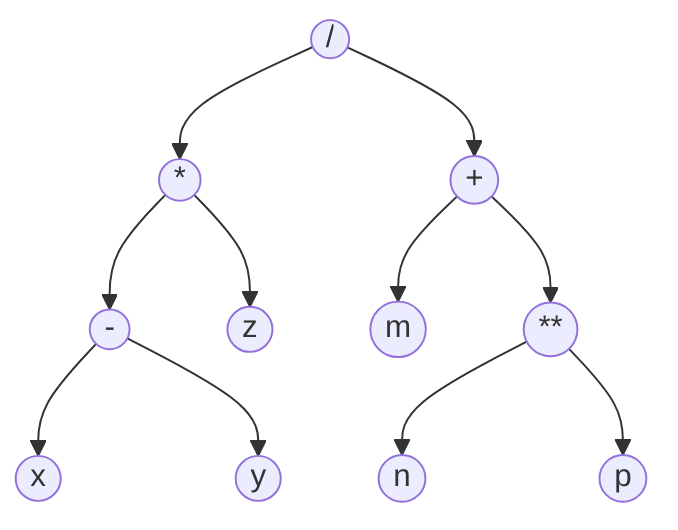

# Árbol de Expresión: [ ( x - y ) * z ] / ( m + n ** p)

## Árbol equivalente

```mermaid
graph TD
    R(("/"))
    M(("*"))
    P(("+"))
    S(("-"))
    E(("**"))
    X(("x"))
    Y(("y"))
    Z(("z"))
    M2(("m"))
    N(("n"))
    P2(("p"))
    
    R --> M
    R --> P
    M --> S
    M --> Z
    S --> X
    S --> Y
    P --> M2
    P --> E
    E --> N
    E --> P2
```
